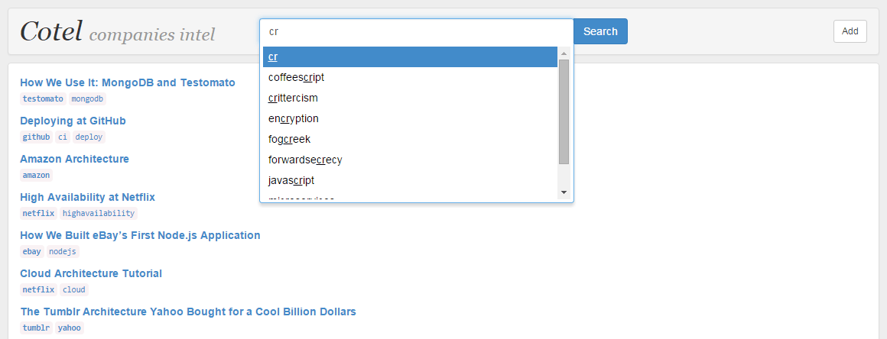
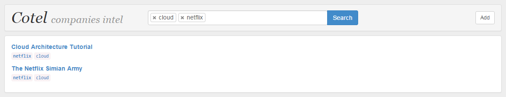

Cotel: companies intel
======================
A ***prototype*** for a library of links to articles describing how companies do their things. *For source code archeologists only.*

The code is of prototype and proof-of-concept quality, it's messy and I don't like it either. I wanted to nuke it from orbit but the data might be of some use to somebody so here it is, with source code and fries. You've been warned.

Data
----
Probably the most interesting thing here is the data. 100 tagged links to articles (and videos) about mostly engineering topics. You know, scaling, architecture, but also a bit of "engineering HR". I've uploaded the data to the [`data`](data) dir, it's exported to SQL and YAML. The latter is missing tag categories, all the tags are equal. Tag categories are used to distinguish between tags used for tagging companies (`netflix`, `amazon`), technologies (`postgresql`, `nodejs`), etc.

Screenshots
-----------
Typing `cr` into the searchbox:

Listing entries tagged with `mongodb`:

Listing entries tagged with `cloud` and `netflix`:

Installation
------------
1. Just *don't* install it
2. In case you still want to, `cd site`
3. Create `log` and `temp` directories
4. Make them writable for your web server user
5. Install dependencies using `composer install`
6. `cd app/config`
7. Copy `config.local.neon.template` to `config.local.neon`
8. Edit `dsn`, `user`, `password` in your new `config.local.neon`
9. Point your virtual host document root to `site/www`
10. ...
11. Profit!

This thingie is powered by [Nette Framework](https://nette.org/), thanks.

*One more thing...* don't you even dare to install it.

Known issues
------------
The code was separated from another repository, so there might be some missing parts here and there. Known issue is that the `X-XSS-Protection` and `Content-Security-Policy` headers are missing.
